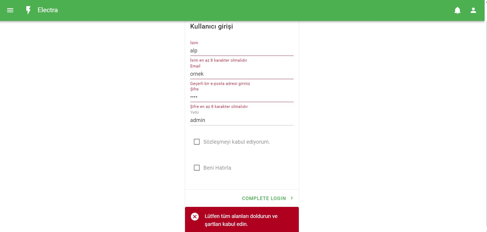
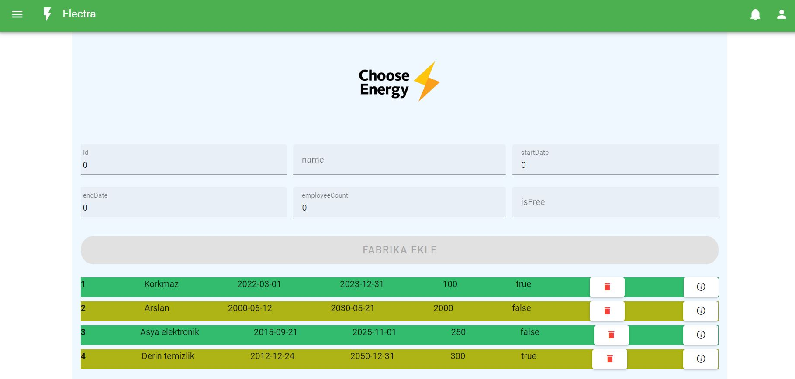
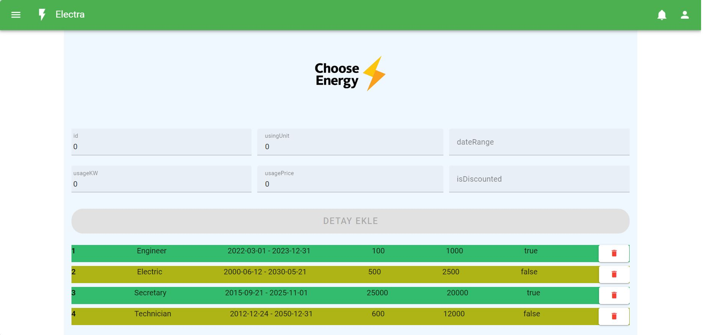

# TimusFullStack-FinalProject

Proje kapsamında enerji kullanımlarını gösteren tablo yoğunluklu kullanıcı giriş ekranlı dashboord
tasarlanacak. Proje için Frontend ve Backend ayrı hazırlanmıştır.

## Backend
Backend projesi nestjs ile hazırlanmıştır.

### Nestjs kurulumu:
```bash
npm i @nestjs/cli
```

Bu yapı controller, module, service, dto içermektedir. Factory ve detail bilgileri postgresql, kullanıcı giriş apilerinde elasticsearch kullanılmıştır. Kullanıcı ilk olarak login olacak.Jwt ve refresh token mantığı kullanılarak gerekli CRUD işlemleri yapılırken "Authorization" ile token kullanılacaktır.

### Nestjs çalıştırılması
```bash
npm run start
```

Postman dokümantasyonu: https://documenter.getpostman.com/view/31368134/2s9Ykq5zTC

## Frontend
Projenin frontend kısmı vuetify ile oluşturulmuştur.

### Vuetify kurulumu
```bash
npm create vuetify

```

### Vuetify çalıştırılması
```bash
npm run dev

```
http://localhost:3000 adresine bağlanılarak projeye giriş yapılır.


* Kullanıcı kaydında ad, email, parola ve yetki (admin veya editor) durumu istenecek tüm
bilgiler tam olmadığı sürece kayıt yapılmayacak ve hata mesajı verecek.
* Ad en az 8 karakter ve numeric değer içermeyecek.
* Email validasyonu olacak parola 8 karakter, en az 1 büyük bir numeric karakter içerecek.


Login yapıldıktan sonra fabrika tablosuna kullanıcı erişebilecektir.

### Fabrika Listesi ve Detay Tablosu



Fabrika listesi tablosunda admin veya editor kişi CRUD işlemlerini burada yapabilmektedir. Yukarıda bilgileri girerek fabrika listesine ekleyebilir. Tablonun içindeki mevcut veriyi silebilir. Ayrıca fabrikanın detay tablosuna gidebilmektedir.


<p align="center">
  Detay tablosu
</p> s


